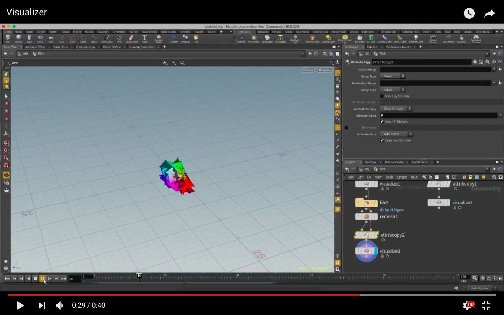

# [https://github.com/all-in-one-of/PBA/blob/master/Projects/solver/visualizer.hipnc](https://github.com/all-in-one-of/PBA/blob/master/Projects/solver/visualizer.hipnc)

# CIS563: Phsyically Based Animation

## How to run the project
1. `/PBA/make`
2. `cd Projects/solver`
3.  - To run the Visualizer: 
        - `./solver 1 simType numParticles`
        - `simType { PARTICLES = 0, LINES = 1, MESH = 1 }` 
    - To run the Spring Force Solver
        - `./solver 0 testcases/input.txt testcases/output.txt`

## Milestones

### Visualizer (1/23/18)

- Utilizes Disney's `Partio` library to hold particle data
- Implemented `Particles`, `SegmentMesh`, and `TriangleMesh` classes
- Writes to various file formats:
    - `.bgeo` : Particles
    - `.poly` : SegmentMesh
    - `.obj` : TriangleMesh
#### How to use with Houdini
- Add a `file` node that will use the `.bgeo` files. This is a bunched up sequence of files that acts as a frame.
- Line nodes are used to visualize `SegmentMeshes` and Remesh nodes are used to visualize `TriangleMeshes`.
- Add an `attributeCopy` node to either the `line` node or `remesh` node.
    - Change the property that has default values of `Cd` to `P`
- Connect the `file` node to the `attributeCopy` input.
- Add a `visualizer` node to display velocities and the like.

### Spring Force Solver (1/31/18)
- Solves spring force and damper force.
- Reads text file with the following format: 
    - `k gamma L px0 py0 pz0 px1 py1 pz1 vx0 vy0 vz0 vx1 vy1 vz1`
    - `k`= Young's Modulus
    - `gamma` = Damping Coefficient
    - `L` = Rest Spring Length
    - Each new line specifies a new test case
- Outputs text file with the following format:
    - `fx0 fy0 fz0 fx1 fy1 fz1 fdx0 fdy0 fdz0 fdx1 fdy1 fdz1`

